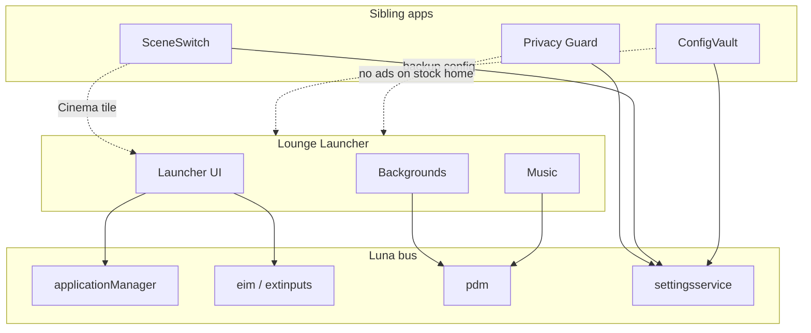

# Lounge Launcher — Design & Feature Specification

Companion to [PLAN.md](PLAN.md). This document captures product identity, naming history, and detailed feature behavior discussed during design. Use PLAN.md for engineering phases, architecture, and delivery checklist.

---

## 1. Product identity

| Field | Value |
|-------|-------|
| **Product name** | Lounge Launcher |
| **On-TV title** | Lounge |
| **Package ID** | `org.webosbrew.lounge.launcher` |
| **Tagline** | *Settle in. Pick what to watch.* |
| **Type** | webOS homebrew fullscreen launcher |
| **Primary target** | LG OLED55C56LB.AEK (o22n3, webOS 10, firmware 33.31.68.01) |
| **Repo listing name** | Lounge Launcher (keep “Launcher” for Homebrew discoverability) |

### What it is

A personal entry screen for your TV:

- **Your wallpaper** — photos or presets, not LG’s home row art
- **Your music** — ambient playlist while you browse what to watch
- **Your apps** — pinned grid only; no sponsored tiles or LG Channels carousel
- **Your inputs** — HDMI and tuner shortcuts in one row

Explicitly **not** a replacement for LG’s stock launcher binary — a homebrew app you open (or boot into) instead of the default home experience.

---

## 2. Naming history

The concept evolved through several names before settling on **Lounge Launcher**.

| Stage | Name | Notes |
|-------|------|-------|
| 1 | FocusBoard | Internal codename; emphasized minimal, distraction-free home |
| 2 | Nocturne | Evocative but hard to pronounce; sounded like a music/screensaver app |
| 3 | Nocturne Launcher | Clearer purpose; still awkward to say |
| 4 | **Lounge Launcher** | Easy to say; fits evening TV, backgrounds, and ambient music |

### Alternatives considered

| Name | Pronunciation | Why not chosen |
|------|---------------|----------------|
| Haven Launcher | *HAY-ven* | Strong runner-up; “safe space” vibe |
| Aura Launcher | *OR-ah* | Ambient mood; less everyday than Lounge |
| Canvas Launcher | — | Background-first; felt more utilitarian |

### Naming conventions

- **GitHub / webosbrew repo / docs:** Lounge Launcher
- **`appinfo.json` title:** Lounge (shorter on-TV label; avoids truncation)
- **Package ID:** `org.webosbrew.lounge.launcher` (short ID, no need for “launcher” twice)

---

## 3. Main screen layout

```
┌──────────────────────────────────────────────────────────────┐
│  ░░░░░░░░  user background (photo / gradient / slideshow) ░░ │
│  ░░░░░░░░░░░░░░░░░░░░░░░░░░░░░░░░░░░░░░░░░░░░░░░░░░░░░░░░░░░ │
│                                                              │
│   [ HDMI 1 ]  [ HDMI 2 ]  [ HDMI 3 ]  [ TV ]                 │
│                                                              │
│   ┌────┐ ┌────┐ ┌────┐ ┌────┐ ┌────┐ ┌────┐ ┌────┐           │
│   │ NF │ │ BF │ │ YT │ │ 🎮 │ │ 📁 │ │ … │ │ ⚙ │           │
│   └────┘ └────┘ └────┘ └────┘ └────┘ └────┘ └────┘           │
│                                                              │
│   ♪ Artist — Track Title                          🔉 ───●──  │
└──────────────────────────────────────────────────────────────┘
```

### UI layers (back to front)

1. **BackgroundLayer** — image, slideshow, or CSS gradient
2. **Scrim overlay** — semi-transparent dark layer (20–60% opacity) for icon legibility
3. **InputRow** — HDMI / tuner chips; highlight last-used input
4. **AppGrid** — pinned apps only; icons from `applicationManager/getAppInfo`
5. **MusicBar** — now-playing, mute, ambient volume slider
6. **Settings entry** — gear tile → settings panels

---

## 4. Backgrounds (detailed)

### 4.1 Sources

| Source | Phase | Description |
|--------|-------|-------------|
| Built-in presets | v1 | Dark gradients, subtle OLED-safe patterns (bundled in `assets/presets/`) |
| USB folder | v1 | User photos on a USB stick |
| Slideshow folder | v2 | Rotate through all images in a directory |
| URL / online | v3+ | Optional fetch (e.g. Unsplash-style); out of scope for v1 |

USB paths resolved at runtime via `com.webos.service.pdm` (`getAttachedStorageDeviceList`) — never hardcode `/media/usb`.

### 4.2 Display modes

| Mode | Behavior | OLED note |
|------|----------|-----------|
| **Static** | Single image, `object-fit: cover` | Risk of burn-in if left hours unchanged |
| **Slideshow** | Rotate every N minutes (default 5 min) | Recommended default for OLED |
| **Ken Burns** | Slow pan/zoom on each photo | Motion reduces static pixel wear |
| **Preset gradient** | CSS gradient, no file I/O | Safest; zero burn-in risk |

### 4.3 Settings (Background panel)

- Choose mode: Static / Slideshow / Preset
- **Choose folder…** — pick directory from attached USB volume
- Slideshow interval (seconds)
- Overlay opacity slider (scrim over background)
- Ken Burns on/off (v2)
- Per-profile background (v2): *Day*, *Night*, *Cinema*

### 4.4 OLED guidance (in-app copy)

Show a short note in Background settings:

> On OLED TVs, prefer **slideshow** or **gradients** over a single static photo left on screen for long periods.

Optional v3 tie-in: when idle, respect `screenSaverSensibility` / dim or switch to a darker preset.

---

## 5. Background music (detailed)

### 5.1 Playback engine

- **MVP:** HTML5 `<audio>` element inside the web app
- **Output routing:** Investigate `com.webos.service.audio` and `soundOutput` setting (`tv_speaker` vs ARC vs Bluetooth) — open question for Phase 0
- **Library scan:** Enumerate files in user’s music folder on USB

### 5.2 Supported sources

| Source | Format |
|--------|--------|
| Folder on USB | `/lounge/music/` |
| Optional playlist | `playlist.m3u` in music folder |
| Shuffle | On by default |
| Repeat | Off / one / all |

### 5.3 Playback behavior by TV state

| State | Music behavior |
|-------|----------------|
| Lounge visible | Play ambient playlist at configured volume |
| User launches Netflix, game, etc. | Fade out over `fadeSec` (default 2s); **pause** (do not stop — preserves position) |
| User returns to Lounge (Home) | Fade in; resume from paused position |
| TV powers off | Stop playback cleanly |

### 5.4 Controls

| Control | Implementation |
|---------|----------------|
| Ambient volume | Slider independent of main TV volume (e.g. default 15%) |
| Mute / Silence | Quick toggle in music bar corner |
| Skip track | Green remote key (v2) |
| Pause | Red remote key (v2) |
| Now playing | Show filename or ID3 title/artist when available |

### 5.5 Audio formats

Target formats on o22n3 (verify on device in Phase 2):

- MP3
- AAC
- FLAC
- OGG

Unsupported formats: skip with a one-line toast; do not crash playlist.

---

## 6. Launcher (apps & inputs)

### 6.1 Pinned apps

- User selects from installed apps (`listApps` / `getAppInfo`)
- Grid shows **only** pinned apps — no LG recommendations
- Launch via `com.webos.applicationManager/launch`
- Reorder pins in Settings (v2)

**Example default pins:**

- Netflix (`netflix`)
- Breezyfin (`com.breezyfin.app`)
- YouTube (`youtube.leanback.v4` or homebrew `youtube-webos`)

### 6.2 Input row

- List inputs from `palm://com.webos.service.eim/getAllInputStatus`
- Switch via `com.webos.service.utp.extinputs` (exact method names **TBD — verify on live TV**)
- User-configurable which inputs appear and custom labels (e.g. “PS5” instead of “HDMI 2”)

### 6.3 Power features (later versions)

| Feature | Version | Description |
|---------|---------|-------------|
| Kid profile | v3 | Whitelist only; hide settings |
| Cinema tile | v3 | One button: Lounge profile + SceneSwitch picture mode + launch chosen app |
| Boot to last HDMI | v3 | Skip launcher; switch input on wake |
| Return on app exit | v2 | Optional auto-foreground Lounge when foreground app closes |

---

## 7. USB folder layout

Users copy this structure to a USB stick (FAT32 or exFAT):

```
/lounge/
├── config.json              # optional; overrides app defaults when USB inserted
├── backgrounds/
│   ├── living-room.jpg
│   ├── abstract-dark.webp
│   └── coast.png
└── music/
    ├── playlist.m3u         # optional
    ├── track01.mp3
    └── track02.flac
```

When `/lounge/config.json` exists on any attached volume, it takes precedence over `localStorage` and bundled defaults.

---

## 8. Configuration schema (full)

```json
{
  "version": 1,
  "profile": "default",
  "background": {
    "mode": "slideshow",
    "path": "/media/usb/lounge/backgrounds/",
    "file": "",
    "slideshowIntervalSec": 300,
    "overlayOpacity": 0.45,
    "kenBurns": true,
    "preset": "warm-gradient"
  },
  "music": {
    "enabled": true,
    "path": "/media/usb/lounge/music/",
    "shuffle": true,
    "repeat": "all",
    "volume": 0.15,
    "fadeSec": 2,
    "pauseOnLaunch": true,
    "resumeOnReturn": true
  },
  "launcher": {
    "pinnedApps": [
      "netflix",
      "com.breezyfin.app",
      "youtube.leanback.v4"
    ],
    "inputs": ["HDMI_1", "HDMI_2", "HDMI_3", "TV"],
    "inputLabels": {
      "HDMI_2": "PS5"
    },
    "showClock": true,
    "bootOnStart": false,
    "returnOnAppExit": false
  },
  "profiles": {
    "night": {
      "background": { "preset": "cool-gradient", "overlayOpacity": 0.6 },
      "music": { "volume": 0.08 }
    },
    "cinema": {
      "background": { "mode": "static", "file": "cinema.jpg" },
      "music": { "enabled": false }
    }
  }
}
```

---

## 9. Version roadmap (feature tiers)

### v1 — Ship first

- [ ] Fullscreen launcher with pinned app grid
- [ ] Static background from USB file or built-in preset
- [ ] Music folder playback with shuffle
- [ ] Fade music out when launching an app; pause (resume on return)
- [ ] HDMI / input row with switch on select
- [ ] Basic config in `localStorage`
- [ ] Installable `.ipk` via Homebrew Channel

### v2 — Polish

- [ ] Slideshow + optional Ken Burns
- [ ] Named profiles (Day / Night / Cinema)
- [ ] Full settings UI (no hand-edited JSON)
- [ ] Remote music controls (Red = pause, Green = skip)
- [ ] Return-to-Lounge when exiting apps (optional)
- [ ] Custom input labels

### v3 — Ecosystem

- [ ] Boot-on-start (root: webOSbrew `init.d` or relaunch hook)
- [ ] NAS paths beyond USB
- [ ] SceneSwitch integration (Cinema button → picture profile)
- [ ] ConfigVault integration (backup/restore `config.json` with TV settings)
- [ ] Kid profile (app whitelist)
- [ ] Art-mode style idle when TV on but unused (`screenSaverArtEnabled` tie-in)

---

## 10. Development phases (summary)

| Phase | Duration | Deliverable |
|-------|----------|-------------|
| **0 — Environment** | ~1 day | Rooted TV, Homebrew Channel, `ares` deploy, Luna API notes |
| **1 — MVP launcher** | 1–2 weeks | Background, app grid, input row, launch Netflix, switch HDMI |
| **2 — Ambient music** | 1 week | USB playlist, shuffle, fade, music bar |
| **3 — Backgrounds** | 1 week | Folder picker, slideshow, presets, overlay control |
| **4 — Settings & profiles** | 1 week | UI for all settings; named profiles; config export |
| **5 — Boot & polish** | 1 week | Boot-on-start, error handling, README, webosbrew submission |

### Phase 0 exit criteria

- [ ] `ares-launch org.webosbrew.lounge.launcher` works on OLED55C56LB
- [ ] Documented working Luna calls for: launch app, list USB, list inputs, switch input
- [ ] Confirmed HTML5 audio plays from USB path (or documented blocker)

### Phase 1 exit criteria

User opens Lounge → sees custom background → launches Netflix → switches to HDMI-2.

### Phase 2 exit criteria

Music plays on Lounge → fades when opening an app → resumes on Home.

---

## 11. Ecosystem fit

Lounge Launcher is one piece of a larger homebrew stack for this TV:



| Companion app | How Lounge benefits |
|---------------|---------------------|
| **Privacy Guard** | Kills ad/ACR services on stock UI; Lounge is the clean surface users actually use |
| **SceneSwitch** | Cinema tile applies picture profile before launching content |
| **ConfigVault** | Backs up Lounge `config.json` alongside TV picture/sound settings after OTA |

---

## 12. Luna services (firmware reference)

From unpacked OLED55C56LB firmware `33.31.68.01-HE_DTV_W25G_AFABATAA/rootfs.pak.unsquashfs`:

| Service | Methods | Use in Lounge |
|---------|---------|---------------|
| `com.webos.applicationManager` | `launch`, `getAppInfo`, `listApps`, `getForegroundApp` | App grid, detect return |
| `com.webos.service.utp.extinputs` | `switchInput`, `getCurrentInput` *(verify)* | HDMI row |
| `palm://com.webos.service.eim` | `getAllInputStatus` | Input list / state |
| `com.webos.service.pdm` | `getAttachedStorageDeviceList` | USB mount paths |
| `com.webos.settingsservice` | `getSystemSettings`, `setSystemSettings` | Sound route, screensaver (optional) |
| `com.webos.service.audio` | TBD | Ambient audio routing |

**Example — launch app:**

```js
webOS.service.request('luna://com.webos.applicationManager', {
  method: 'launch',
  parameters: { id: 'netflix', params: {} }
});
```

**Example — list USB storage:**

```js
webOS.service.request('luna://com.webos.service.pdm', {
  method: 'getAttachedStorageDeviceList',
  parameters: { subscribe: false }
});
```

---

## 13. Risks (design-level)

| Risk | Mitigation |
|------|------------|
| Static wallpaper burn-in on OLED | Default slideshow; in-app OLED tip |
| “Lounge” truncated on app row | Short title in `appinfo.json`; full name in repo |
| Music + soundbar routing unclear | Phase 0 probe; document limitation if TV-speaker only |
| USB sandbox blocks `file://` | May need homebrew service or root path bridge |
| Stock home still exists | Expected — Lounge is an alternative entry, not a patch |

---

## 14. Open questions (resolve in Phase 0)

1. Exact `extinputs` Luna method names on o22n3 UK firmware
2. Can web apps read USB image/audio paths directly, or is a service required?
3. Boot-on-start: `webOSRelaunch` activity vs root `/var/lib/webosbrew/init.d` script
4. Does HTML5 audio respect `soundOutput` (ARC to soundbar) or only TV speakers?
5. Icon art direction: Sandstone-native vs custom Lounge brand

---

## 15. Success criteria

- Core features work **without root** (except boot-on-start)
- UI interactive within **3 seconds** of launch
- First-run setup (background + 3 apps + music folder) completable in **under 5 minutes**
- Listed on [repo.webosbrew.org](https://repo.webosbrew.org/)
- Positive feedback from OpenLGTV / webOS homebrew community

---

## 16. Document map

| File | Purpose |
|------|---------|
| [PLAN.md](PLAN.md) | Engineering plan: architecture, phases, testing, distribution |
| **PLAN2.md** (this file) | Design spec: naming, backgrounds, music, UX, ecosystem |
| `README.md` | User-facing install and USB setup (to be written) |
| `docs/luna-api.md` | Verified Luna calls from live TV (Phase 0 output) |

---

*Last updated: 2026-07-04*