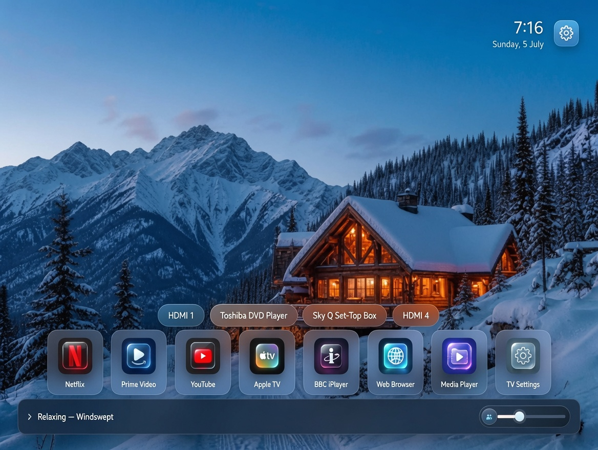
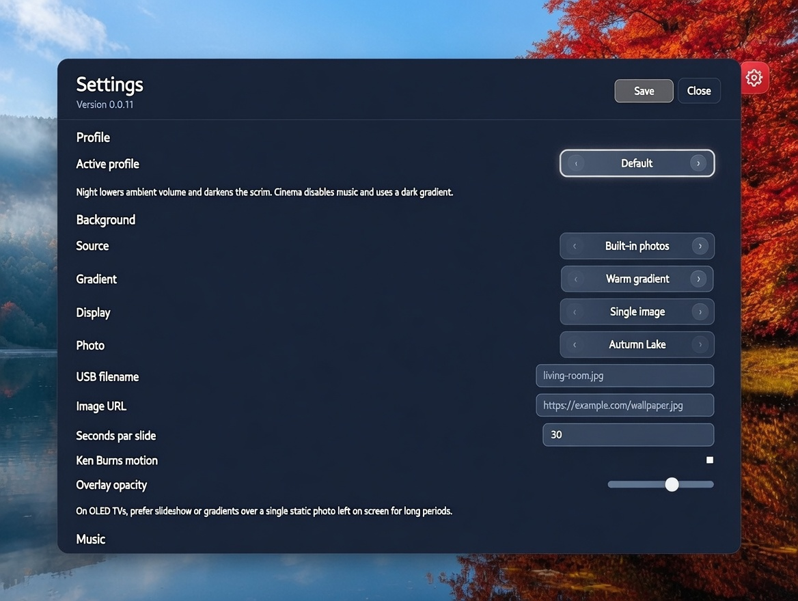

# webOS Lounge Launcher

A fullscreen home screen for rooted LG webOS TVs. Pick an app, switch inputs, and enjoy ambient background music — without the stock launcher clutter.





## Features

- App grid with pinned streaming apps, plus custom app tiles (pin any installed app by App ID with a bundled icon)
- HDMI and TV input shortcuts with custom labels
- Scenic backgrounds and built-in ambient music that keeps playing while settings are open
- Clock with optional date, both independently toggleable
- Volume bar that mirrors the TV's remote volume changes
- Adjustable icon size and left/center/right icon alignment
- Dedicated app settings button and a TV Settings tile for quick access to system settings
- Remote-friendly navigation

## Compatibility

Tested and working on the LG OLED55C56LB running webOS 25.

## Install

Requires a rooted LG TV with [Homebrew Channel](https://github.com/webosbrew/webos-homebrew-channel) and SSH enabled.

```bash
npm install
./install2tvfrommacos.sh
```

Set your TV's IP if needed:

```bash
TV_IP=192.168.0.79 ./install2tvfrommacos.sh
```

Or build manually:

```bash
npm run pack
ares-install --device webos dist/*.ipk
```

## Running elevated as root (required for app scanning)

**Why this is required.** Retail webOS only returns the *full* list of installed
apps (`luna://com.webos.applicationManager/listApps`) to **privileged (root)
clients**. A normal sandboxed web app can only see its own launch points, so the
built-in **Scan for apps** feature returns nothing unless the launcher runs with
elevated (root) Luna privileges. On a rooted TV that elevation is provided by the
[Homebrew Channel](https://github.com/webosbrew/webos-homebrew-channel) root
service (`luna://org.webosbrew.hbchannel.service/exec`), which executes as root.

### 1. Elevate (grants root)

SSH into the TV (the installer already provisions `root@TV_IP` key auth) and run
the Homebrew Channel elevation helper:

```bash
ssh root@TV_IP
/media/developer/apps/usr/palm/services/org.webosbrew.hbchannel.service/elevate-service
```

### 2. Persist across reboots and app updates

Copy the Homebrew Channel startup script into the boot location so elevation is
re-applied automatically on every boot:

```bash
cp /media/developer/apps/usr/palm/services/org.webosbrew.hbchannel.service/startup.sh \
   /var/lib/webosbrew/startup.sh
```

This lives **outside** the launcher's own app directory
(`/media/developer/apps/usr/palm/applications/org.webosbrew.lounge.launcher`), so
reinstalling or updating the Lounge Launcher `.ipk` does **not** remove it —
root elevation survives app updates.

### 3. (Optional) Force re-elevation on every boot

Homebrew Channel runs any executable placed in `/var/lib/webosbrew/init.d` at
boot as root. Add a hook so the service is always re-elevated after an update:

```bash
mkdir -p /var/lib/webosbrew/init.d
cat > /var/lib/webosbrew/init.d/30-lounge-elevate <<'EOF'
#!/bin/sh
/media/developer/apps/usr/palm/services/org.webosbrew.hbchannel.service/elevate-service
EOF
chmod +x /var/lib/webosbrew/init.d/30-lounge-elevate
```

> Note: A full **TV firmware update** can reset root. If app scanning stops
> working after a system update, re-root the TV / reinstall Homebrew Channel and
> repeat steps 1–2.

## License

MIT